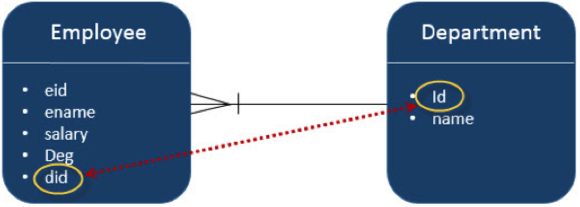
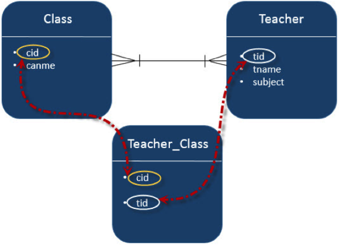

#ORM (Object Relational Mapping) with JPA (Java Persistence API)
## Day 1: Introduction to ORM
[Tutorial for JPA](http://www.tutorialspoint.com/jpa/jpa_introduction.htm)
- Java Persistence API is a source to store business entities (java objects) as relational entities (db tables) 
- Challenges:  
  - Table structure in db vs graph structure in objects (references containing references ...)
  - Inheritance: Objects with inheritance hierarchy to be mirrored in tables
  - DB tables contains only scalar values like int and string.

###Pros and Cons  
  - Pros:
    - ORM typically reduces the amount of code that needs to be written
    - Avoids low level JDBC and SQL code
    - rovides database and schema independence
    - It allows us to use the OO-paradigm  
  - Cons:
    - The high level of abstraction can obscure what is actually happening in the implementation code. 
    - Heavy reliance on ORM software has been cited as a major factor in producing poorly designed databases.
    - There are a variety of difficulties that arise when considering how to match an object system to a relational database. 
- Our goal is to uphold the illusion that we are only working in an OO world (even when manipulating data)  

###Some questions that arise  
- How are columns, rows, tables mapped to objects?
- How are relationships handled?
- How is OO inheritance mapped to relational tables?
- How is composition and aggregation handled?
- How are conflicting type systems between databases handled?
- How are objects persisted?
- How are different design goals handled:
  - Relational model designed for data storage/retrieval
  - Object Oriented model is about modelling behaviour 

###Java vs DB: Mismatch issues
- Example – collections versus tables 
  - Java/C# use collections to manage lists of objects
  - Databases uses tables to manage lists of entities

- Example – blobs versus objects
  - Databases uses blobs to manage large objects as simple binary data
  - Java/C# use objects with behaviors 

###JPA providers:  
  - Hybernate  
  - **EclipseLink** [reference](https://en.wikibooks.org/wiki/Java_Persistence/EclipseLink)  
  - Toplink  

###JPA architecture: javax.Persistence  
  

###Annotations   
| Annotation | Description                                                           |
|------------|-----------------------------------------------------------------------|
|@Entity     |	This annotation specifies to declare the class as entity or a table. |
|@Table      |	This annotation specifies to declare table name.|
|@Basic	     |  This annotation specifies non constraint fields explicitly.|
|@Embedded   |	This annotation specifies the properties of class or an entity whose value instance of an embeddable class.|
|@Id	     |  This annotation specifies the property, use for identity (primary key of a table) of the class.|
|@GeneratedValue|	This annotation specifies, how the identity attribute can be initialized such as Automatic, manual, or value taken from sequence table.|
|@Transient  | This annotation specifies the property which in not persistent i.e. the value is never stored into database.|
|@Column     | This annotation is used to specify column or attribute for persistence property.|
|@SequenceGenerator   |	This annotation is used to define the value for the property which is specified in @GeneratedValue annotation. It creates a sequence.|
|@TableGenerator      |	This annotation is used to specify the value generator for property specified in @GeneratedValue annotation. It creates a table for value generation.|
|@AccessType	| This type of annotation is used to set the access type. If you set @AccessType(FIELD) then Field wise access will occur. If you set @AccessType(PROPERTY) then Property wise assess will occur.|
|@JoinColumn	| This annotation is used to specify an entity association or entity collection. This is used in many- to-one and one-to-many associations.|
|@UniqueConstraint    |	This annotation is used to specify the field, unique constraint for primary or secondary table.|
|@ColumnResult	| This annotation references the name of a column in the SQL query using select clause.|
|@ManyToMany	| This annotation is used to define a many-to-many relationship between the join Tables.|
|@ManyToOne	| This annotation is used to define a many-to-one relationship between the join Tables.|
|@OneToMany	| This annotation is used to define a one-to-many relationship between the join Tables.|
|@OneToOne	| This annotation is used to define a one-to-one relationship between the join Tables.|
|@NamedQueries	| This annotation is used for specifying list of named queries.|
|@NamedQuery	| This annotation is used for specifying a Query using static name.|  

###The Entity class
- Typically, an entity represents a table in a relational database, 
- Each entity instance corresponds to a row in that table.  

- Entity classes are very similar to Java beans in that they follow a set of rules.
- Entity Classes must (:
  - be annotated with the @Entity annotation.
  - have (at least) a public or protected, no-argument constructor. 
  - The class must not be declared final. No methods or persistent instance variables must be declared final.
  - If an entity instance is passed by value as a detached object, the class must implement the Serializable interface.
  - Entities may extend both entity and non-entity classes, and non-entity classes may extend entity classes.
  - Persistent instance variables must be declared private, protected, or package-private and can be accessed directly only by the entity class's methods.  
  
###Entity example:  
```java  
@Entity 
public class Book
{
  @Id private Long id;
  private String title;
  private Float price;
  private String description;
  private String isbn;
  private Integer nbOfPage;
  private Boolean illustrations;
  public Book() { }
  // Getters, setters
 }
```  

Above example shows how 2 annotations is enough to turn this class into a JPA entity.
This is done by using the principle: [Configuration by Exception](http://stackoverflow.com/questions/34125441/what-is-exactely-a-configuration-by-exception-in-jpa)

###Let's demo!  
  


###Persistence.xml: the Persistence Unit (PU)
  - registers the database and specify the entity class  
  - Drop and Create, Create or ...  
  - Remember to ALWAYs **clean and build** the project after changing the PU.  
- The entities  
  - Try creating an entity from a database  
  - Try creating a database from an entity  
  - Pros and Cons  
    - Easier to write the objects and let JPA worry about the tables  
    - When JPA creates the Entity we get a few Named Queries "for free".  
- Getting started: set up the first project.  
1. Create the project.
2. Create a database and connect (for this demo I use mysql database: jpa1)
3. Add the MYSQL JDBC Driver to the project libraries 
4. Create a new Persistance Unit (right click project and choose new...) choose EclipseLink JPA 2.1 (Should be the default choice for the Persistence Provider) 
5. Create new file -> Entity Class. Name it Person. Then create the file below with an EntityManager based on the Persistence Unit See how running the persist() method creates a new table in the database called person with ID, Age and Name. To get the created SQL from EclipseLink insert the following 2 property lines in to the persistence.xml. :
  - <property name="eclipselink.logging.level.sql" value="FINE"/><property name="eclipselink.logging.parameters" value="true"/>  


###Resources:
 - [](https://hendrosteven.wordpress.com/2008/03/06/simple-jpa-application-with-netbeans/)
 - [](http://www.javacodegeeks.com/2015/02/jpa-tutorial.html - this one provides detailed information)
###Exercise 1 - Basic JPA
[Find the exercise here](exercises/JPA_MappingExercise-1.pdf)


##Day 2 - More JPA
### Relationships
  - [JPA relationships](http://www.tutorialspoint.com/jpa/jpa_entity_relationships.htm)  

| Cardinality | Direction               |  Example |
|-------------|-------------------------|----------|
| One-to-one  | Unidirectional  | person and car |
| One-to-one  | Bidirectional   | person and spouse|
| One-to-many | Unidirectional  | workplace and work station |
| Many-to-one/one-to-many | Bidirectional| student and teacher |
| Many-to-one | Unidirectional  | student and school |
| Many-to-many| Unidirectional  | person and phone |
| Many-to-many| Bidirectional   | employee and company car |

Many to One relationship  
  


Many to many relationship:  
  

- when bidirectional be ALERT!! on setting the reference on both objects  
```java
    PhoneNo phone = new PhoneNo();
    Person person1 = new Person();
    person.addPhone(phone); //HERE
    phone.setPerson(person1); //AND HERE
    phone.setNumber("+45 3225 8921");
    em.persist(person1);
    em.persist(phone);
```
###Inheritance
- 3 strategies
  - Single table
    - DTYPE collumn and null values
  - Joined
    - One table for the super class and one for each sub class containing the extended data
  - Table per Class
    - 

###Exercise 2 - Relationships
[Find the exercise here](exercises/JPA_MappingExercise-2.pdf)

